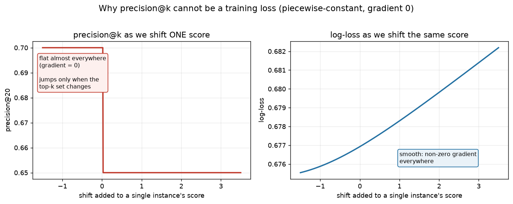
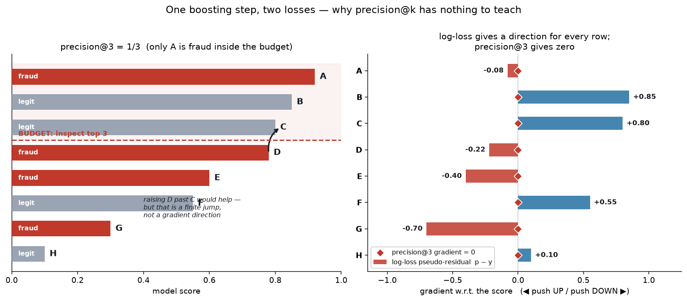
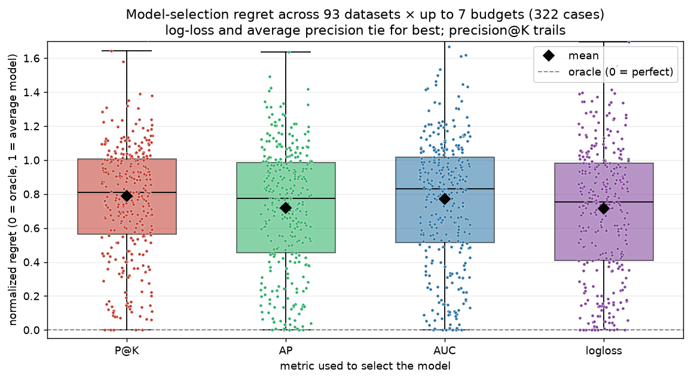
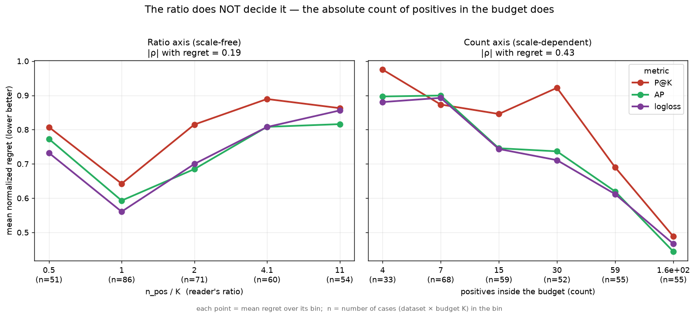
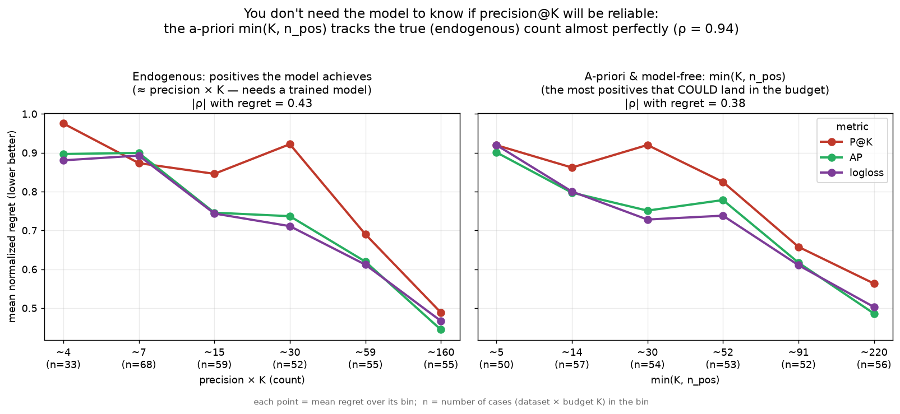

# Precision@100 es un objetivo excelente y un juez peligroso

### La métrica que te importa puede ser la equivocada para *entrenar* — y, más sorprendente aún, la equivocada para *seleccionar*

Imagina que diriges la unidad de fraude de una comercializadora eléctrica. Ahí fuera hay millones de contadores, algunos manipulados. Tu modelo puntúa cada instalación con una probabilidad de fraude. Y tienes una brigada que puede inspeccionar **100 instalaciones al mes**. Ni 101, ni 500. Cien.

Ese único número lo cambia todo. Si un defraudador real acaba en el puesto 250, da igual que tu modelo lo pusiera en el percentil 80 o en el 50 — nunca será inspeccionado. Lo único que genera dinero es la **concentración de fraude real dentro del top 100**. Todo lo demás — una calibración preciosa en el 99% inferior, una curva ROC suave — es, operativamente, decoración.

Esto es un **problema top-k con presupuesto fijo**: rankeas una población, actúas sobre el top *k*, y *k* lo fija algo externo al modelo (una brigada, un presupuesto, una cuota legal). La métrica natural es **precision@k** — de las *k* cosas sobre las que actuaste, ¿qué fracción eran reales?

precision@<em>k</em>=positivos reales dentro del top <em>k</em><em>k</em>

La forma aparece por todas partes: inspecciones fiscales (audita las 2.000 declaraciones de arriba), campañas de retención (500 ofertas), llamadas médicas (30 pacientes esta semana). Mismo esqueleto: una cola, un equipo que solo llega al principio, y un suelo por debajo del cual la opinión del modelo es irrelevante.

Así que el objetivo no es "ser bueno de media". Es "que el top 100 sea lo más limpio posible". Lo que plantea la pregunta obvia: si precision@100 es lo que me importa, ¿por qué no entrenar con ella?

---

## Por qué precision@100 no puede ser tu función de pérdida

Porque es **constante a trozos y no diferenciable**, así que su gradiente es cero en casi todas partes — y un gradiente cero no enseña nada.

Precision@100 depende de tus puntuaciones *solo a través de qué 100 elementos acaban arriba*. Mueve una predicción un pelín: casi siempre el conjunto del top 100 no cambia, así que precision@100 no cambia, así que su derivada es exactamente **cero**. La métrica solo reacciona en el instante en que un elemento cruza el corte e intercambia su puesto con el vecino — un salto brusco de 1/100. Plana, plana, plana, escalón, plana.

**La Figura 1** lo muestra: desliza la puntuación de un elemento y precision@k es una línea plana con un solo acantilado, mientras que la log-loss es una curva suave que siempre sabe hacia dónde es mejor.

Por eso el gradient boosting (y las redes neuronales, y todo lo que se entrena por descenso de gradiente) usa log-loss. El boosting ajusta cada nuevo árbol al **gradiente negativo de la pérdida** — la señal de "esto fallaste, y por dónde arreglarlo". Concretémoslo: ocho instalaciones, presupuesto k = 3, a mitad de entrenamiento.

| item | score *p* | etiqueta *y* | gradiente log-loss (*p − y*) | gradiente precision@3 |
|---|---|---|---|---|
| A | 0,92 | fraude (1) | −0,08 | 0 |
| B | 0,85 | legal (0) | **+0,85** | 0 |
| C | 0,80 | legal (0) | **+0,80** | 0 |
| D | 0,78 | fraude (1) | −0,22 | 0 |
| E | 0,60 | fraude (1) | −0,40 | 0 |
| F | 0,55 | legal (0) | +0,55 | 0 |
| G | 0,30 | fraude (1) | −0,70 | 0 |
| H | 0,10 | legal (0) | +0,10 | 0 |

Las tres primeras son A, B, C, así que **precision@3 = 1/3** (solo A es fraude). Para la log-loss con sigmoide el gradiente es simplemente ***p − y***: B y C son falsos positivos colocados arriba, reciben gradientes positivos grandes ("bájalos"); D, E, G son fraudes que se escaparon ("súbelos"). Cada fila recibe una instrucción con signo.

Ahora precision@3. Sube la puntuación de D un pelín (0,78 → 0,781): sigue cuarto, el top-3 no cambia, precision sigue 1/3 — derivada **0**. Hazlo para las ocho filas y la última columna son **ceros de arriba abajo**. *Existe* un movimiento útil — subir a D por encima de C, dejando el top-3 en {A, B, D} y precision@3 en 2/3 — pero es un salto *finito*, y un gradiente solo ve el entorno infinitesimal. Así que al árbol se le entrega un objetivo de todo ceros y no aprende nada (Figura 2).

Fíjate en el remate (panel derecho): el gradiente de la log-loss ya empuja a C *abajo* y a D *arriba* — justo el intercambio que subiría precision@3. El surrogate suave, sin que nadie le hable del presupuesto, empuja hacia el mismísimo movimiento que la métrica con presupuesto quería pero no podía pedir. (Existen surrogates diferenciables para pérdidas top-k — Kar et al. 2015, "Accuracy at the Top" de Boyd et al., el truco de LambdaMART — pero para la mayoría de sistemas la respuesta pragmática sigue siendo: **entrena con log-loss, evalúa con precision@100.**)

---

## La pregunta de verdad: ¿debería ser siquiera tu métrica de *selección*?

Durante el entrenamiento necesitamos una derivada, así que precision@100 queda fuera. Durante la **evaluación** — early stopping, y elegir cuál de cientos de configuraciones desplegar — solo necesitamos *calcularla*. Así que está permitida. Y aquí casi todo el mundo deja de pensar: claro que seleccionas por la métrica que te importa.

Pero hay **dos fuerzas tirando en direcciones opuestas.**

**Fuerza 1 — alineación (a favor de precision@100).** La log-loss es un objetivo *global*; premia la calibración en toda la distribución, no el top 100. Imagina que el fraude viene en familias: una común y fácil (*manipulación descarada del contador*) que el modelo ya puntúa arriba, y otras raras y sutiles (*puenteos silenciosos*) a media tabla. Para bajar la log-loss media, al modelo le sale rentable empujar muchos casos sutiles de 0,3 a 0,5 — una gran ganancia sumada sobre muchas filas — aunque deje que algún fraude descarado resbale del puesto 90 al 110, fuera del presupuesto. La log-loss mejora; precision@100 — el dinero — baja. **Un modelo que parece mejor por log-loss puede ser peor en lo único que da dinero**, y solo precision@100 lo cazaría.

**Fuerza 2 — estabilidad (en contra de precision@100).** Precision@100 solo lee 100 filas — en realidad, solo cuántas son positivas. Es una proporción de una muestra minúscula, así que es *ruidosa*. Elige la mejor de cientos de configuraciones sobre el mismo conjunto de validación y en parte eliges a la que **tuvo suerte** — la *maldición del ganador* — así que la elección generaliza peor, y el número reportado sale inflado.

Cuál fuerza gana no se puede saber solo razonando: hay que medirlo. Así que lo medí.

### Cómo lo medí

El diseño es simple, y conviene decirlo claro porque el resultado depende de él:

1. Entreno un banco de **40 modelos** (hiperparámetros aleatorios, todos con log-loss) en un split de `train`.
2. En un split de `validation`, puntúo cada modelo con cada métrica candidata: **precision@k, average precision (AP), AUC, log-loss**.
3. Para cada métrica, me quedo con el modelo que **la maximiza en validación** — eso es "seleccionar por esa métrica".
4. A ese modelo elegido le mido su **precision@k en un split de `test`** — el objetivo real, idéntico para todas las métricas.
5. Pregunto: ¿qué elección — la de precision@k o la de una rival — tiene mayor precision@k en *test*?

Lo corrí sobre **93 datasets** (90 reales desbalanceados de las colecciones `imbalanced-learn` y OpenML — fraude, impago, churn, quiebras, cribado médico… — más 3 sintéticos), barriendo el presupuesto K en un rango amplio por dataset. Para agrupar datasets muy distintos uso el **regret normalizado**: 0 = elegiste el mejor modelo del banco, 1 = no mejor que uno medio. Menos es mejor.

El titular es lo contraintuitivo:

> **El modelo elegido por log-loss (o AP) en validación suele tener *mayor* precision@k en test que el elegido por la propia precision@k en validación.**

Seleccionar por la métrica exacta que te importa te da un peor resultado en esa métrica — porque en parte seleccionas sobre la suerte de validación (Fuerza 2), y la elección más estable de la log-loss cae en un modelo genuinamente mejor.

---

## Lo que dicen 93 datasets

**1. De media, log-loss y average precision ganan; precision@k va por detrás** (Figura 3). Regret medio: log-loss 0,71, AP 0,72, precision@k 0,79 (AUC en medio). Por cuántas veces cada métrica elige el mejor modelo: log-loss 34%, precision@k 25%, AP 21%, AUC 20%.

**2. No es un ratio — es un recuento.** El instinto natural es que precision@k debería ir bien cuando el presupuesto es "suficiente" respecto a los positivos — algún ratio adimensional como *n_pos / K*. No es así: ese ratio apenas predice nada. Lo que de verdad predice la dificultad de selección es el **número absoluto de positivos reales que caen en el presupuesto** — cuantos más positivos hay arriba, mejor selecciona *toda* métrica (Figura 4, derecha). Y es una relación mucho más fuerte que la del ratio: la correlación de Spearman es de **0,43** en magnitud, frente a un mísero **0,19** del ratio. La razón es estadística básica — precision@k es una proporción, y la fiabilidad de una proporción la fija el número de aciertos detrás, un *recuento*, no una fracción. Dos empresas con el mismo ratio se comportan distinto si una es diez veces mayor.

**3. Y ese recuento se puede conocer por adelantado.** Objeción justa: "positivos en el presupuesto" ≈ precisión × K depende del modelo — lo que estás seleccionando. Pero su **techo libre de modelo, `min(K, n_pos)`** — los positivos que como mucho *podrían* caer en el presupuesto, conocido por tu presupuesto y cuántos positivos tienes — predice casi igual de bien (correlación de 0,38, casi la 0,43 de antes) y sigue al recuento verdadero casi a la perfección (0,94). Así que la cantidad decisiva es conocible antes de entrenar (Figura 5). ¿Quieres el número exacto? Entrena un baseline barato y cuenta los positivos reales en su top-k de validación.

**No hay un régimen limpio donde precision@k mande**: solo se adelanta en el rincón donde el presupuesto es diminuto frente a un pool grande de positivos, y nunca por mucho. Y la otra cara de su ruido: la precision@k de validación reportada **sobreestima** la precisión verdadera cuantos menos positivos hay en el presupuesto — decenas de por ciento, a veces más del 2× — así que también te da un número más bonito del que verás en producción.

---

## Conclusiones prácticas

- **Mantén precision@k como objetivo y métrica de titular — nunca como función de pérdida.** Entrena con log-loss; reporta precision@presupuesto porque es lo que siente el negocio.
- **Para elegir qué modelo desplegar, por defecto: average precision o log-loss.** En 93 datasets empataron como mejores y ganaron más veces; precision@k fue mediblemente peor y de vez en cuando reventó.
- **No busques un umbral de ratio — no existe.** La palanca que importa es `min(presupuesto, positivos que tienes)`: el recuento de positivos que pueden caer en tu presupuesto. Si es pequeño, *ninguna* métrica elegirá bien de forma fiable — consigue más positivos etiquetados o un presupuesto mayor, no una métrica más lista.
- **Usa precision@k como criterio de desempate, no como selector primario**; cuando discrepe con una métrica estable, fíate de la estable. Sáltate el AUC en problemas de presupuesto fijo.
- **Nunca cites la precision@k de validación en crudo como rendimiento esperado en producción** cuando el presupuesto es pobre en positivos — reporta una estimación anidada / held-out.

Un modelo mental compacto: precision@k es una proporción medida a partir de los positivos dentro de tu presupuesto, así que su fiabilidad — como *selector* y como *número reportado* — la fija **cuántos positivos son**, no un ratio de tasas. Su alineación es la razón para quererla; su varianza, la razón para desconfiar; haz crecer el recuento, no ajustes un ratio.

*Limitaciones: una sola familia de modelos (LightGBM), 40 configuraciones por dataset, selección estudiada sobre un banco fijo (el early stopping debería comportarse igual). La "calidad verdadera" en datasets pequeños es ruidosa, mitigada agrupando 93 datasets. Toda recomendación es sobre calidad esperada — en un proyecto puedes tener suerte. Código y figuras reproducibles desde una semilla fija (`experiment_real3.py`, `meta_real3.py`).*
